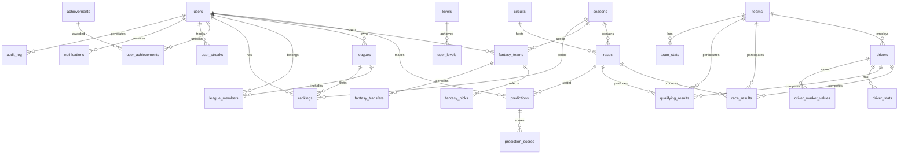

# Entity Relationship Diagram

```mermaid
erDiagram
    users ||--o{ predictions : makes
    users ||--o{ fantasy_teams : owns
    users ||--o{ leagues : owns
    users ||--o{ league_members : belongs
    users ||--o{ rankings : has
    users ||--o{ user_achievements : unlocks
    users ||--o{ user_streaks : tracks
    users ||--o{ notifications : receives
    users ||--o{ audit_log : generates

    teams ||--o{ drivers : employs
    teams ||--o{ race_results : participates
    teams ||--o{ qualifying_results : participates
    teams ||--o{ team_stats : has

    drivers ||--o{ race_results : competes
    drivers ||--o{ qualifying_results : competes
    drivers ||--o{ driver_stats : has
    drivers ||--o{ driver_market_values : valued

    circuits ||--o{ races : hosts

    seasons ||--o{ races : contains
    seasons ||--o{ fantasy_teams : scope
    seasons ||--o{ rankings : period

    races ||--o{ race_results : produces
    races ||--o{ qualifying_results : produces
    races ||--o{ predictions : target

    predictions ||--o{ prediction_scores : scores

    fantasy_teams ||--o{ fantasy_picks : selects
    fantasy_teams ||--o{ fantasy_transfers : performs

    leagues ||--o{ league_members : includes
    leagues ||--o{ rankings : filters

    achievements ||--o{ user_achievements : awarded
    levels ||--o{ user_levels : achieved
```
